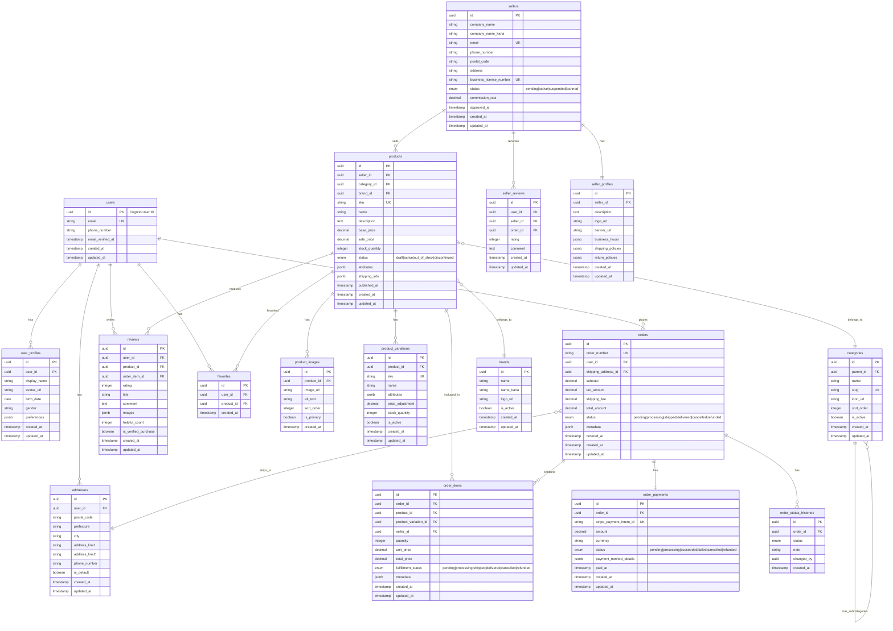

# ECレコメンドシステム データベース設計書

## 1. 概要

本システムは、PostgreSQL（メインDB）とDynamoDB（NoSQL）のハイブリッド構成を採用します。

### データベース配置方針
- **PostgreSQL**: トランザクショナルデータ、リレーショナルデータ
- **DynamoDB**: セッション、カート、ユーザー嗜好、高速アクセスが必要なデータ
- **OpenSearch**: 商品検索、ログ分析

## 2. ER図（PostgreSQL）



## 3. DynamoDBテーブル設計

### 3.1 Sessions Table
```yaml
TableName: Sessions
PartitionKey: session_id (String)
TTL: expires_at
Attributes:
  - session_id: String
  - user_id: String
  - data: Map
  - created_at: Number
  - expires_at: Number
  - ip_address: String
  - user_agent: String
```

### 3.2 Carts Table
```yaml
TableName: Carts
PartitionKey: user_id (String)
SortKey: product_id (String)
TTL: expires_at
Attributes:
  - user_id: String
  - product_id: String
  - product_variation_id: String
  - quantity: Number
  - added_at: Number
  - updated_at: Number
  - expires_at: Number
  - price_snapshot: Number
  - metadata: Map
```

### 3.3 UserPreferences Table
```yaml
TableName: UserPreferences
PartitionKey: user_id (String)
Attributes:
  - user_id: String
  - language: String
  - currency: String
  - notification_settings: Map
  - privacy_settings: Map
  - recommendation_preferences: Map
  - updated_at: Number
```

### 3.4 UserActivities Table (レコメンド用)
```yaml
TableName: UserActivities
PartitionKey: user_id (String)
SortKey: timestamp (Number)
GSI1:
  - PartitionKey: activity_type (String)
  - SortKey: timestamp (Number)
Attributes:
  - user_id: String
  - timestamp: Number
  - activity_type: String (view|cart_add|purchase|search|favorite)
  - product_id: String
  - category_id: String
  - search_query: String
  - session_id: String
  - metadata: Map
```

## 4. インデックス設計

### 4.1 PostgreSQL インデックス

```sql
-- Users
CREATE INDEX idx_users_email ON users(email);
CREATE INDEX idx_users_created_at ON users(created_at);

-- Products
CREATE INDEX idx_products_seller_id ON products(seller_id);
CREATE INDEX idx_products_category_id ON products(category_id);
CREATE INDEX idx_products_status ON products(status);
CREATE INDEX idx_products_price ON products(base_price);
CREATE INDEX idx_products_created_at ON products(created_at);

-- Orders
CREATE INDEX idx_orders_user_id ON orders(user_id);
CREATE INDEX idx_orders_status ON orders(status);
CREATE INDEX idx_orders_created_at ON orders(created_at);
CREATE INDEX idx_order_items_seller_id ON order_items(seller_id);

-- Reviews
CREATE INDEX idx_reviews_product_id ON reviews(product_id);
CREATE INDEX idx_reviews_user_id ON reviews(user_id);
CREATE INDEX idx_reviews_rating ON reviews(rating);
```

### 4.2 OpenSearch インデックス

```json
{
  "products": {
    "mappings": {
      "properties": {
        "id": { "type": "keyword" },
        "name": { 
          "type": "text",
          "analyzer": "kuromoji",
          "fields": {
            "keyword": { "type": "keyword" }
          }
        },
        "description": { 
          "type": "text",
          "analyzer": "kuromoji"
        },
        "category_path": { "type": "keyword" },
        "brand": { "type": "keyword" },
        "price": { "type": "float" },
        "attributes": { "type": "nested" },
        "seller_id": { "type": "keyword" },
        "status": { "type": "keyword" },
        "created_at": { "type": "date" },
        "popularity_score": { "type": "float" }
      }
    }
  }
}
```

## 5. データ分割戦略

### 5.1 マイクロサービス別データベース

| サービス | データベース | テーブル/コレクション |
|---------|------------|-------------------|
| User Service | PostgreSQL | users, user_profiles, addresses |
| Product Service | PostgreSQL | products, categories, brands, product_* |
| Order Service | PostgreSQL | orders, order_items, order_payments, order_status_histories |
| Review Service | PostgreSQL | reviews, seller_reviews |
| Session Service | DynamoDB | Sessions |
| Cart Service | DynamoDB | Carts |
| Analytics Service | DynamoDB | UserActivities |
| Search Service | OpenSearch | products index |

### 5.2 データ同期戦略

- **CDC (Change Data Capture)**: Debeziumを使用してPostgreSQLの変更をキャプチャ
- **Event Streaming**: Kinesisを使用してリアルタイムデータ同期
- **Batch Sync**: 定期的なバッチ処理で整合性確認

## 6. パフォーマンス最適化

### 6.1 パーティショニング

```sql
-- 注文テーブルの月次パーティショニング
CREATE TABLE orders_2024_01 PARTITION OF orders
FOR VALUES FROM ('2024-01-01') TO ('2024-02-01');
```

### 6.2 キャッシュ戦略

- 商品情報: Redis (TTL: 1時間)
- カテゴリ階層: Redis (TTL: 24時間)
- ユーザーセッション: Redis (TTL: 30分)

## 7. データ移行・バックアップ

### 7.1 バックアップポリシー

- **PostgreSQL**: 
  - 日次自動バックアップ (7日間保持)
  - ポイントインタイムリカバリ有効化
- **DynamoDB**: 
  - 継続的バックアップ有効化
  - オンデマンドバックアップ (月次)

### 7.2 ディザスタリカバリ

- **RPO**: 1時間
- **RTO**: 4時間
- **Multi-AZ**: 有効化
- **Cross-Region Replication**: 検討中

## 8. セキュリティ

### 8.1 暗号化

- 保存時暗号化: 全データベースで有効化
- 転送時暗号化: TLS 1.2以上

### 8.2 アクセス制御

- IAMロールベースアクセス
- データベースレベルの行レベルセキュリティ (RLS)
- 個人情報のマスキング処理

## 9. モニタリング

### 9.1 監視項目

- 接続数
- クエリパフォーマンス
- ストレージ使用率
- レプリケーション遅延

### 9.2 アラート設定

- CPU使用率 > 80%
- ストレージ使用率 > 85%
- 長時間実行クエリ > 5秒
- デッドロック検出